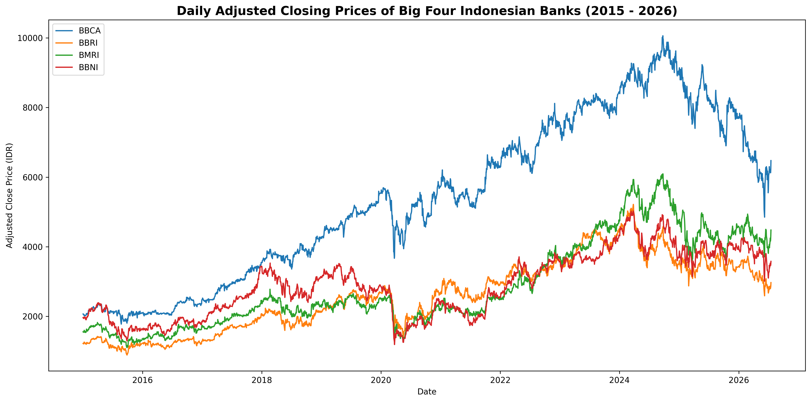
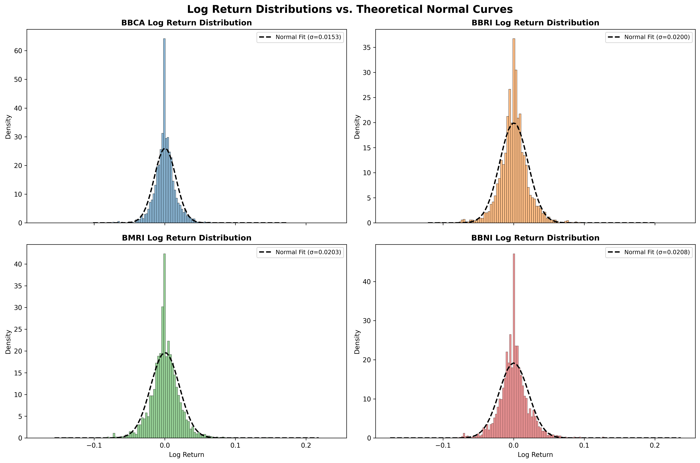
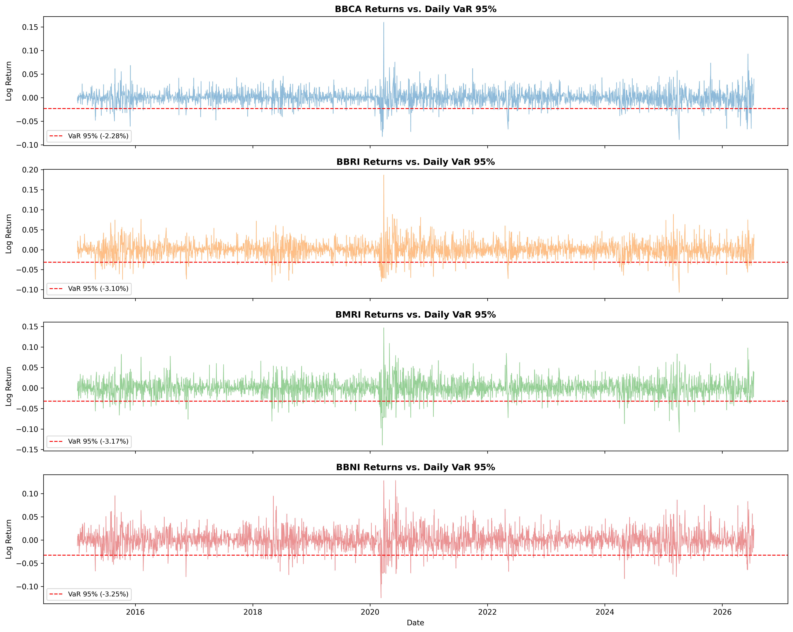
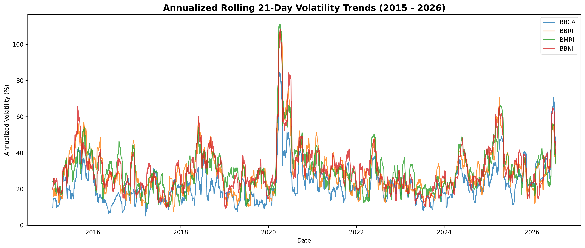
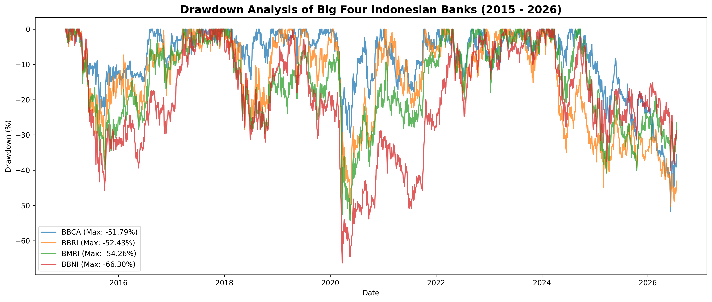
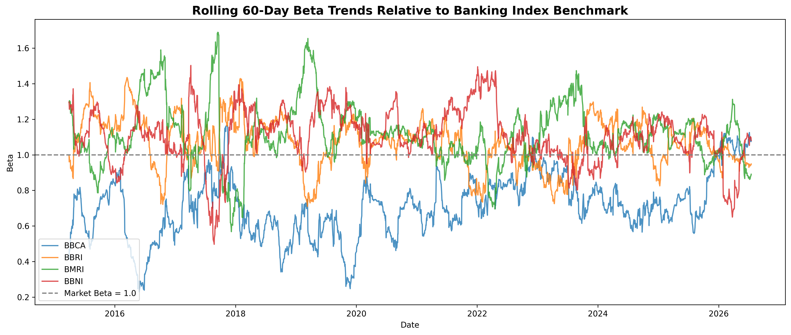
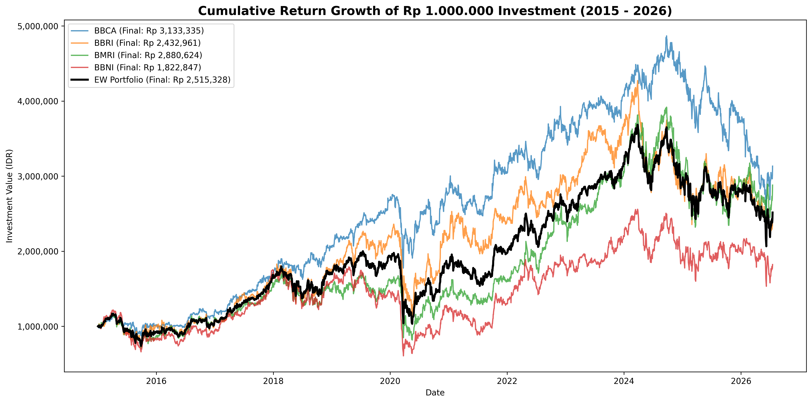
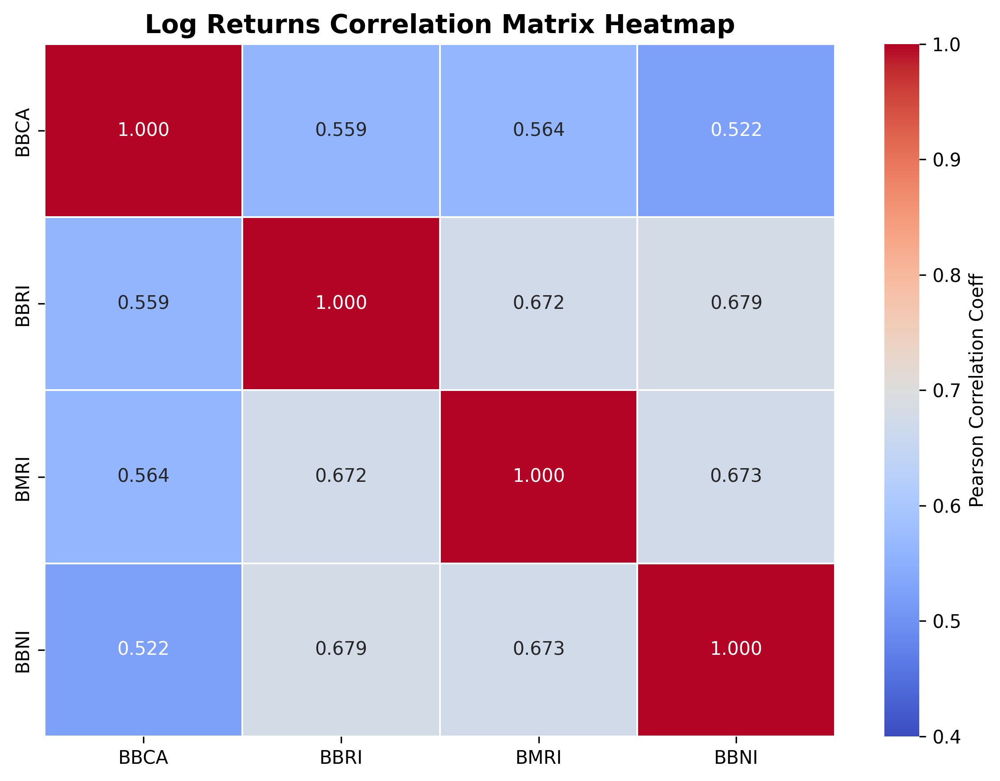

# Analisis Finansial Kuantitatif & Valuasi Portofolio Saham Big Four Bank Indonesia (2015 - 2026)

Proyek ini menyajikan analisis kuantitatif dan valuasi portofolio terhadap empat emiten perbankan terbesar (*The Big Four* / *Big Banks*) di Bursa Efek Indonesia (BEI): **PT Bank Central Asia Tbk (BBCA)**, **PT Bank Rakyat Indonesia (Persero) Tbk (BBRI)**, **PT Bank Mandiri (Persero) Tbk (BMRI)**, dan **PT Bank Negara Indonesia (Persero) Tbk (BBNI)** selama periode **2 Januari 2015 hingga 17 Juli 2026** (2.840 hari perdagangan).

Analisis ini menggunakan pendekatan statistik keuangan dan teori portofolio modern untuk mengukur profil risiko, return historis, risiko ekstrim pasar, korelasi sektoral, sensitivitas beta, serta keterkaitannya dengan indikator fundamental perbankan nyata.

---

## 📂 Struktur Proyek

*   📂 **`data/`**
    *   `BBCA.csv`, `BBRI.csv`, `BMRI.csv`, `BBNI.csv` - Data historis masing-masing emiten dari Yahoo Finance.
    *   `combined_close.csv` - Data gabungan harga penutupan yang disesuaikan (*dividend/split adjusted close*).
*   📂 **`images/`** - Visualisasi plot komputasi yang dibahas di bawah ini.
*   📓 **`notebook.ipynb`** - Jupyter Notebook yang berisi baris kode Python bersih untuk pemrosesan data, kalkulasi return log barian, pengujian statistik, estimasi risiko stokastik, dan eksekusi visualisasi plot.

---

## 📈 Metodologi Analisis

1.  **Transformasi Data**: Harga saham harian diubah menjadi log return harian ($r_t = \ln(P_t/P_{t-1})$) untuk menjamin sifat aditif waktu dan memenuhi asumsi model statistik keuangan.
2.  **Uji Stasioneritas (ADF)**: Uji *Augmented Dickey-Fuller* dilakukan untuk membuktikan data log return bersifat stasioner ($H_0$: data memiliki unit root / non-stasioner ditolak jika $p\text{-value} < 0.05$).
3.  **Uji Normalitas (Jarque-Bera)**: Uji statistik untuk melihat apakah sebaran return berdistribusi normal ($H_0$: skewness = 0, excess kurtosis = 0).
4.  **Estimasi Risiko Pasar**:
    *   **Value at Risk (VaR) 95%**: Batas kerugian maksimum harian pada tingkat kepercayaan 95%.
    *   **Expected Shortfall (ES) 95%**: Rata-rata ekspektasi kerugian harian ekstrim jika kerugian melampaui ambang batas VaR 95%.
5.  **Dinamika Risiko**:
    *   **Rolling Volatility 21-Hari**: Standar deviasi bergerak harian yang disetahunkan (*annualized*) untuk mendeteksi *volatility clustering*.
    *   **Maximum Drawdown (MDD)**: Penurunan maksimum dari titik puncak (*peak*) ke palung (*trough*) historis.
6.  **Analisis Beta Sektoral**: Koefisien Beta ($\beta$) bergerak 60-hari dihitung terhadap indeks tertimbang sama (*Equal-Weighted Index*) perbankan untuk melihat tingkat sensitivitas (defensif vs agresif).
7.  **Portofolio Benchmark**: Simulasi portofolio tertimbang sama (*Equal-Weighted Portfolio*, alokasi 25% masing-masing) untuk menguji efisiensi diversifikasi.

---

## 📊 Hasil Kuantitatif & Pembahasan Visualisasi

### 1. Tren Harga Saham Jangka Panjang
Harga saham historis telah disesuaikan secara otomatis terhadap pemecahan saham (*stock split*) dan dividen (*adjusted close price*).

*   **Pembahasan**: Grafik menunjukkan tren naik jangka panjang (*secular bull trend*) yang sangat kuat, terutama pada **BBCA** yang bergerak paling stabil dengan fluktuasi terkendali. Kenaikan BBCA didukung oleh efisiensi internal yang luar biasa. 
*   Sebaliknya, bank BUMN (**BBRI, BMRI, BBNI**) menunjukkan fluktuasi siklikal makroekonomi yang lebih tajam. Penurunan terdalam terjadi serentak pada kuartal pertama tahun 2020 akibat panik pasar di awal pandemi COVID-19, diikuti oleh fase pemulihan (*recovery*) yang sangat kuat mulai akhir 2020 hingga pertengahan 2026.

### 2. Karakteristik Return & Pengujian Statistik
Sebaran log return harian masing-masing emiten dibandingkan terhadap kurva normal teoritis fitting.

#### Tabel Hasil Uji Stasioneritas & Normalitas
| Emiten | ADF Statistic | p-value (ADF) | Skewness | Excess Kurtosis | JB Statistic | p-value (JB) | Distribusi Normal? |
| :--- | :---: | :---: | :---: | :---: | :---: | :---: | :---: |
| **BBCA** | -9.904 | $3.30 \times 10^{-17}$ | 0.387 | 7.514 | 6750.30 | 0.000 | **TIDAK (Fat-Tails)** |
| **BBRI** | -28.192 | 0.000 | 0.260 | 4.869 | 2836.22 | 0.000 | **TIDAK (Fat-Tails)** |
| **BMRI** | -19.593 | 0.000 | 0.035 | 4.128 | 2015.87 | 0.000 | **TIDAK (Fat-Tails)** |
| **BBNI** | -50.163 | 0.000 | 0.187 | 3.507 | 1471.67 | 0.000 | **TIDAK (Fat-Tails)** |

*   **Pembahasan**:
    *   **Stasioneritas**: Seluruh emiten bank menolak H0 pada ADF Test dengan *p-value* mutlak 0.000 (jauh di bawah 5%). Ini membuktikan log return bersifat stasioner dan layak digunakan untuk pemodelan kuantitatif berekor gemuk.
    *   **Ekor Gemuk (*Fat-Tails*)**: Uji Jarque-Bera secara kuat menolak asumsi distribusi normal ($p\text{-value} = 0.000$). Semua return saham memiliki nilai *excess kurtosis* positif yang signifikan (tertinggi BBCA sebesar 7.514). Ini membuktikan keberadaan fenomena *leptokurtic* (distribusi return memiliki puncak yang lebih runcing dan ekor yang lebih tebal). Dalam praktiknya, fluktuasi ekstrim (kenaikan/penurunan tajam harian) terjadi jauh lebih sering di pasar riil dibandingkan asumsi model finansial standar berdistribusi normal.

### 3. Estimasi Risiko Pasar (VaR & Expected Shortfall)
Grafik di bawah ini memetakan pergerakan return harian historis terhadap garis ambang batas risiko Value at Risk (VaR) 95%.

#### Tabel Estimasi Risiko Harian
| Emiten | Daily VaR 95% (%) | Daily Expected Shortfall 95% (%) |
| :--- | :---: | :---: |
| **BBCA** | 2.28% | 3.46% |
| **BBRI** | 3.10% | 4.58% |
| **BMRI** | 3.18% | 4.63% |
| **BBNI** | 3.25% | 4.72% |

*   **Pembahasan**:
    *   **BBCA** memiliki **VaR 95% terendah (2.28%)** dan **Expected Shortfall terendah (3.46%)**. Artinya, pada hari perdagangan normal, probabilitas kerugian harian BBCA yang melebihi 2.28% hanya sebesar 5%, dan jika kondisi ekstrim terlampaui, rata-rata kerugiannya adalah 3.46%. Ini mengukuhkan BBCA sebagai emiten dengan pertahanan risiko terbaik di sektornya.
    *   **BBNI** menunjukkan tingkat risiko ekstrim tertinggi dengan VaR 3.25% dan ES 4.72%, mengindikasikan sensitivitas fluktuasi harian yang lebih agresif.

### 4. Dinamika Risiko: Volatility Clustering & Drawdown
Fluktuasi risiko diamati secara dinamis menggunakan rolling annualized volatility dan maximum drawdown.

*   **Pembahasan**:
    *   **Volatility Clustering**: Grafik rolling volatility 21-hari memperlihatkan lonjakan risiko yang serentak di awal tahun 2020 (volatilitas tahunan melonjak hingga kisaran 60% - 90% akibat pandemi). Setelah fase panik mereda, volatilitas berangsur menyempit, membuktikan bahwa ketidakpastian pasar bersifat dinamis dan mengelompok pada periode waktu tertentu.
    *   **Maximum Drawdown**: Selama periode 11 tahun, penarikan terdalam (*maximum drawdown*) dialami oleh **BBNI sebesar -66.30%** dan **BMRI sebesar -54.26%**. Penurunan ini mencerminkan sensitivitas bank BUMN terhadap penarikan likuiditas asing (*foreign outflows*) saat sentimen makro memburuk. **BBCA** mencatat drawdown minimum relatif sebesar **-51.79%**, menunjukkan daya tahan yang lebih kuat terhadap tekanan jual bursa jangka panjang.

### 5. Risiko Sistemik & Sensitivitas Sektoral (Beta)
Sensitivitas return masing-masing saham diukur terhadap Indeks Tertimbang Sama perbankan (*Equal-Weighted Big Banks Index*).

#### Rata-rata Beta Historis
*   **BBCA**: 0.710 (Defensif, $\beta < 1$)
*   **BBRI**: 1.066 (Agresif/Siklikal, $\beta > 1$)
*   **BMRI**: 1.116 (Agresif/Siklikal, $\beta > 1$)
*   **BBNI**: 1.108 (Agresif/Siklikal, $\beta > 1$)

*   **Pembahasan**:
    *   Beta **BBCA secara konsisten berada di bawah 1.0 (rata-rata 0.710)**. Hal ini secara kuantitatif membuktikan sifat defensif BBCA yang tidak mudah bergejolak mengikuti fluktuasi rata-rata pasar sektoral. BBCA bertindak sebagai jangkar portofolio (*safe haven*).
    *   Sebaliknya, ketiga bank BUMN memiliki rata-rata Beta di atas 1.0, menunjukkan perilaku yang lebih agresif dan responsif terhadap dorongan pasar sektoral perbankan.

### 6. Analisis Kinerja Portofolio & Efek Diversifikasi
Perbandingan hasil investasi kumulatif awal Rp 1.000.000 antara aset tunggal dan portofolio diversifikasi setara (*Equal-Weighted Portfolio*).

#### Perbandingan Kinerja Portofolio vs Saham Tunggal (Suku Bunga Bebas Risiko = 5.0% p.a.)
| Parameter | BBCA | BBRI | BMRI | BBNI | EW Portfolio |
| :--- | :---: | :---: | :---: | :---: | :---: |
| **Annualized Return (%)** | 10.14% | 7.89% | 9.39% | 5.33% | **8.19%** |
| **Annualized Volatility (%)** | 24.37% | 31.79% | 32.24% | 33.03% | **25.70%** |
| **Sharpe Ratio** | 0.211 | 0.091 | 0.136 | 0.010 | **0.124** |
| **Max Drawdown (%)** | -51.79% | -52.43% | -54.26% | -66.30% | **-48.37%** |
| **Nilai Akhir Investasi (IDR)** | Rp 3,133,330 | Rp 2,433,005 | Rp 2,880,637 | Rp 1,822,849 | **Rp 2,525,666** |

*   **Pembahasan**:
    *   **Korelasi Sektoral**: Heatmap menunjukkan korelasi Pearson harian berkisar antara **0.55 hingga 0.72**. Korelasi terkuat ada pada pasangan BMRI-BBRI (0.713) dan BMRI-BBNI (0.712). Hal ini dikarenakan ketiganya memiliki karakteristik kepemilikan negara (BUMN) yang serupa dan digerakkan oleh arus dana institusi asing yang sama. BBCA memiliki korelasi terendah dengan bank lain (misalnya 0.554 dengan BBNI).
    *   **Manfaat Diversifikasi**: Portofolio *Equal-Weighted* (EW Portfolio) menghasilkan kinerja drawdown terendah (**-48.37%**), jauh lebih kecil dibandingkan drawdown terkecil emiten tunggal sekalipun (BBCA sebesar -51.79%). Volatilitas portofolio terpangkas menjadi **25.70%** (jauh lebih rendah dibanding volatilitas rata-rata bank BUMN yang melebihi 31-33%). Ini membuktikan secara empiris Teori Portofolio Modern Harry Markowitz, di mana penggabungan aset dengan korelasi tidak sempurna (< 1) sukses meredam risiko spesifik (*idiosyncratic risk*) portofolio tanpa harus mengorbankan return secara berlebihan.

---

## 🏛️ Valuasi Fundamental & Korelasi Harga Pasar

Dalam analisis keuangan industri perbankan (*banking analytics*), pergerakan harga saham sangat berkorelasi erat dengan metrik operasional riil bank. Berikut perbandingan parameter kinerja keuangan kunci (*typical industry averages*):

| Bank | Fokus Utama Bisnis | Rata-rata ROE (%) | NPL Gross (%) | NIM (%) | Rata-rata PE Ratio | Rata-rata PB Ratio |
| :--- | :--- | :---: | :---: | :---: | :---: | :---: |
| **BBCA** | Ritel & CASA (Dana Murah) | 20.5% | 1.9% | 5.5% | 24.5x | 4.8x |
| **BBRI** | Kredit Mikro & UMKM | 18.2% | 3.1% | 7.8% | 14.2x | 2.3x |
| **BMRI** | Korporasi & Digital Banking | 21.1% | 1.2% | 5.4% | 11.5x | 2.1x |
| **BBNI** | Korporasi & Global Banking | 14.5% | 2.3% | 4.4% | 9.8x | 1.2x |

### Analisis Keterkaitan Fundamental dan Harga Pasar:
1.  **Mengapa Valuasi BBCA Paling Premium? (PB Ratio ~4.8x)**
    BBCA menguasai jaringan transaksi ritel nasional yang masif di Indonesia, menghasilkan kontribusi dana murah (CASA ratio) konsisten di atas 80%. Ini memberikan bank biaya dana (*cost of funds*) yang sangat rendah (di bawah 2%). Hasilnya, BBCA memiliki daya tahan margin bunga bersih (NIM) yang sangat stabil serta rasio kredit macet (NPL) yang sangat rendah (~1.9%). Pasar bersedia membayar harga premium untuk profitabilitas yang kokoh dan berisiko sangat rendah ini (*flight to quality*).
2.  **Karakteristik High-Yield BBRI (NIM ~7.8%)**
    BBRI memiliki NIM paling tinggi karena fokus penyaluran kredit pada segmen mikro dan ultra-mikro (Kupedes & PNM Mekaar) yang yield bunganya tebal. Namun, segmen mikro memiliki volatilitas kredit macet yang lebih sensitif terhadap daya beli masyarakat bawah, tercermin dari rasio NPL Gross yang lebih tinggi (~3.1%). Hal ini menjelaskan mengapa volatilitas return harian saham BBRI (`31.79%`) jauh lebih tinggi dari BBCA (`24.37%`).
3.  **Efisiensi Radikal BMRI (ROE ~21.1%)**
    BMRI membukukan ROE tertinggi di antara Big Four berkat efisiensi digital (*Livin'* untuk retail dan *Kopra* untuk korporasi) yang menurunkan beban operasional secara masif serta dominasi kuat pada penyaluran kredit korporasi besar nasional dengan kualitas aset prima (NPL Gross terendah `1.2%`). Valuasi BMRI pada PB ratio 2.1x merupakan opsi investasi bertumbuh (*growth value*) yang sangat atraktif bagi fund manager global.

---

## 🎯 Kesimpulan & Rekomendasi Portofolio

Berdasarkan analisis kuantitatif dan fundamental di atas, rekomendasi alokasi portofolio perbankan dirumuskan sebagai berikut:

1.  **Jangkar Portofolio (Defensif)**: **BBCA** direkomendasikan sebagai porsi penahan guncangan portofolio terbesar (*core holding*). Karakteristik volatilitas rendah, drawdown minimal, dan Beta defensif (0.710) terbukti efektif menjaga nilai aset portofolio tetap tangguh saat pasar makroekonomi sedang lesu.
2.  **Mesin Return (Growth)**: **BMRI** dan **BBRI** direkomendasikan untuk dibeli secara agresif saat siklus pemotongan suku bunga bank sentral dimulai atau ketika pertumbuhan ekonomi nasional sedang ekspansif guna mendongkrak return portofolio secara keseluruhan.
3.  **Batas Diversifikasi Sektoral**: Karena korelasi Pearson antar bank besar ini cukup kuat (0.55 - 0.72), diversifikasi hanya di dalam kelompok Big Four tidak dapat memproteksi portofolio dari risiko kejatuhan pasar sistemik sektoral secara penuh (seperti krisis pandemi awal 2020). Investor direkomendasikan untuk memasangkan portofolio perbankan ini dengan sektor non-siklikal yang korelasinya rendah (seperti Consumer Staples atau Telekomunikasi).
